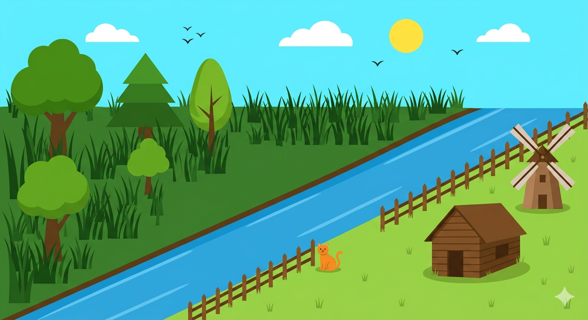
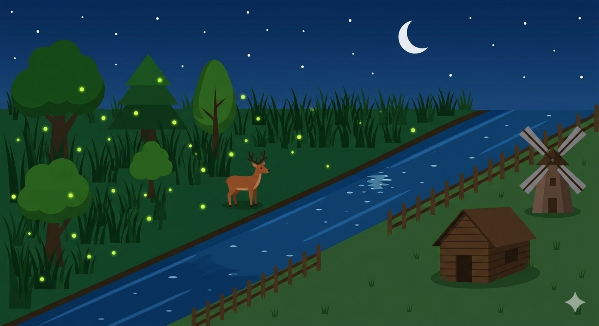

# Project Sketch

**Course Code:** CSE422  
**Course Title:** Computer Graphics Lab  
**Project Name:** Zero Point – Where Forest Meets Village

---

## Submitted By

| Name | ID |
|---|---|
| MD. Walid Ahmed | 0242220005101595 |
| Tahmid Alam Tamim | 0242220005101578 |
| Md. Wasif Khan Lodi | 0242220005101584 |
| Nafis Sharier Dodul | 0242220005101576 |
| Sadibul Hasan Sadib | 0242220005101563 |

## Submitted To

**Teacher Name:** Lecturer, Mushfiqur Chowdhury  
**Department:** Computer Science and Engineering (CSE), Daffodil International University

**Date of Submission:** 19-03-2026

---

## 1. Introduction

Zero Point is a 2D OpenGL-based animated scene that simulates two distinct environments — a forest and a village — meeting at a shared boundary. The scene is divided by a diagonal river running from the top-right to the bottom-left of the screen, creating a natural border between the two worlds. The upper-left region represents the forest and the lower-right region represents the village. The project includes a time-aware system where the scene transitions between day and night states, each revealing different visual elements and animal behaviors.

---

## 2. Motivation

The theme was chosen because of the concept of two entirely different worlds existing side by side and meeting at a single point. The forest and the village represent two contrasting environments — wild and domestic, dark and warm — and the river as their shared boundary felt like a natural and visually interesting way to tell that story. The day and night system adds another layer, where each state reveals a different character of the same scene.

---

## 3. Project Theme / Idea

The scene is split into three zones:

- **Sky (top 20%)** — contains the sun or moon, stars, birds, and clouds depending on the time state
- **Forest zone (upper-left triangle)** — dense trees, tall grass, deer at night, fireflies at night
- **Village zone (lower-right triangle)** — house, windmill, fence, short grass, cat during day

The diagonal river separates the forest and village. Animals respect this boundary — the deer stays on the forest side and the cat stays on the village side. The scene automatically toggles between day and night. A keyboard shortcut also allows manual toggling for demonstration purposes.

---

## 4. Sketch of Project Scene

**Day Mode**



**Night Mode**



---

## 5. Detailed Description of Scene Components

**Sky** — A background quad that changes color between light blue (day) and deep navy (night). Contains the sun or moon drawn using the Midpoint Circle algorithm. Stars appear as `GL_POINTS` at night. Birds appear as small V-shapes using `GL_LINES` during the day and drift slowly across the sky.

**River** — A diagonal strip running from top-right to bottom-left across the 80% ground zone. Both edges are drawn using the Bresenham Line algorithm. The strip is filled between the two edges.

**Forest zone** — Contains 3–4 trees of varying sizes drawn using triangles and rectangles. Tall grass is drawn using longer `GL_LINES` in darker green tones. At night, the deer appears near the river edge and moves back and forth using ping-pong translation. Fireflies appear as `GL_POINTS` with slow random drift.

**Village zone** — Contains a house built from rectangles and a triangle roof. A windmill with rotating blades sits nearby. Fence posts run along the river edge on the village side, drawn using DDA lines. Short grass uses shorter `GL_LINES` in lighter green. During the day, the cat appears near the river edge and moves back and forth.

---

## 6. Transformation Plan

| Transformation | Applied To |
|---|---|
| Translation | Cat (day), Deer (night), Birds (day) |
| Rotation | Windmill blades — constant, always active |
| Scaling | Trees drawn at different sizes to suggest depth |

Rotation is implemented using `glPushMatrix` / `glRotatef` / `glPopMatrix` to isolate the blade rotation from the windmill body. Translation for animals uses a ping-pong boundary system where direction reverses at set x-limits.

---

## 7. Animation Plan

- **Cat** — ping-pong translation along village river edge, day only, hidden at night
- **Deer** — ping-pong translation along forest river edge, night only, hidden during day
- **Birds** — slow left-to-right drift across sky, loop back when off-screen, day only
- **Windmill** — constant angle increment each frame using `glRotatef`, always active
- **Fireflies** — small random position offsets each frame within a fixed forest bounding box, night only
- **Day/Night toggle** — automatic timer increments each frame in the idle function and flips the state every ~500 frames. Manual keyboard shortcut also available.

---

## 8. Program Structure Plan

The program is structured as a single `main.cpp` file with clearly separated functions:

```
main.cpp
├── drawBresenhamLine()   ← river edges
├── drawDDALine()         ← fence posts
├── drawMidpointCircle()  ← sun / moon
├── drawSky()             ← background, sun/moon, stars
├── drawBirds()           ← day only
├── drawRiver()           ← diagonal filled strip
├── drawForest()          ← trees, tall grass
├── drawVillage()         ← house, windmill, short grass
├── drawFence()           ← DDA lines along river edge
├── drawDeer()            ← night only
├── drawCat()             ← day only
├── drawFireflies()       ← night only
├── update()              ← all animation + timer logic
└── display()             ← calls everything in order
```

**Algorithms used:**
- **Bresenham Line** — for diagonal river edges
- **DDA Line** — for fence post lines
- **Midpoint Circle** — for sun and moon

**Completed so far:** `drawSky()` is implemented including sun (Midpoint Circle), moon (Midpoint Circle), stars (`GL_POINTS`), and basic clouds. Keyboard shortcut for manual day/night toggle is working.

**Remaining:** River, forest zone, village zone, all animals, windmill rotation, birds, fireflies, automatic timer.

---

## 9. Progress Status

### ✅ Completed
- OpenGL window setup
- Sky zone fully drawn — sun, moon (Midpoint Circle), stars, clouds
- Keyboard shortcut to manually toggle day/night state
- Day/night color system working for the sky

### 🔲 Remaining
- Diagonal river with Bresenham edges
- Forest zone — trees, tall grass, deer, fireflies
- Village zone — house, windmill, fence, cat
- All animations — cat, deer, birds, windmill, fireflies
- Automatic day/night timer

**GitHub Repository:** https://github.com/ShrekBytes/zero-point

---

## 10. Expected Challenges

**Drawing the diagonal river correctly** — filling the strip between two Bresenham lines cleanly without gaps or overflow into the forest/village zones.  
*Plan: use a filled polygon between the two edge points.*

**Keeping animals within their zone boundaries** — especially the deer which must stay strictly on the forest side of the diagonal river.  
*Plan: hardcode x-boundary limits per zone rather than calculating dynamically.*

**Windmill blade rotation staying centered** — blades must rotate around the correct pivot point.  
*Plan: use `glPushMatrix` / `glTranslatef` to move to pivot first, then rotate, then draw.*

---

## 11. Conclusion

Zero Point is a 2D OpenGL scene that demonstrates graphics primitives, line drawing algorithms, 2D transformations, and time-driven animation within a meaningful real-world theme. The concept of a forest and village meeting at a river boundary provides a natural structure for applying all required EP attributes. The sky zone is currently functional and the remaining components will be implemented in the coming two weeks following the build order established in the program structure plan.